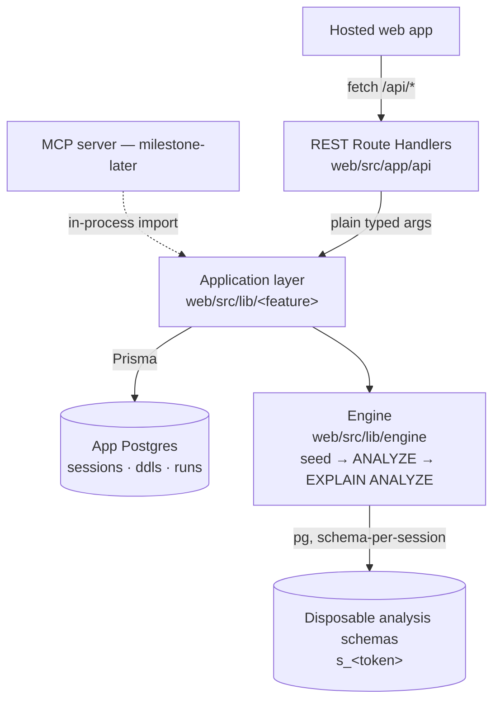

# ARCHITECTURE.md: System Mental Map

This provides the System Mental Map. It tells the agent where things live and how they talk to each other.

- **Contents:** Data flow, tech stack, directory structure, and API boundaries.
- **Utility:** Helps agents understand where to place new files and how services interact.

## System Flow

The logic lives below the transport. HTTP Route Handlers (and, later, an MCP
server) are thin adapters over a transport-agnostic **application layer** in
`src/lib`, which orchestrates the deterministic **engine** and Prisma storage.
The same Zod schemas validate HTTP input and define the MCP tool input later.



Both the app metadata and the disposable analysis schemas live in the same
Postgres instance for v1 (see API Boundaries). The engine reaches Postgres
through a narrow interface so the same code runs against local Docker or a Neon
branch.

## Tech Stack

### Frontend
- **Framework:** Next.js (App Router)
- **Styling:** Tailwind CSS (Vanilla CSS preferred for custom components)
- **State:** TanStack Query for server state.

### Backend
- **Runtime:** Node.js (Next.js Route Handlers; no separate service in v1)
- **ORM:** Prisma 7 (app metadata: sessions, ddls, analysis runs)
- **Database:** PostgreSQL 18 + pgvector
- **Engine DB driver:** node-postgres (`pg`) for the disposable analysis
  schemas — raw SQL (`COPY`, `EXPLAIN ANALYZE`, `CREATE SCHEMA`), not Prisma.
- **SQL parsing:** `libpg-query` (the official PG C parser as WASM) for both
  DDL and the query DML — no custom regex.
- **Validation/contract:** Zod schemas in `src/lib/<feature>`, shared by the
  Route Handler (request validation) and the future MCP tool (tool input).

## Directory Structure Explanations

- `web/src/app/api/`: REST Route Handlers — thin transport adapters only.
- `web/src/lib/<feature>/`: Application layer — orchestration + Zod schemas,
  framework-agnostic, the unit the MCP server will import later.
- `web/src/lib/engine/`: The deterministic engine (seed → `ANALYZE` →
  `EXPLAIN ANALYZE`). Imports nothing from `next/*`.
- `web/src/components/`: UI-only atoms and molecules. Strictly presentational.

### Good Directory Constraint
"All business logic resides in `/src/lib`. Components are strictly for presentation and must not contain `useEffect` for data fetching."
*Utility: Prevents 'spaghetti code' and ensures predictable data flow.*

### Bad Directory Constraint
"Put files wherever they fit."
*Utility: High friction for agents trying to locate existing patterns, leading to duplicate code.*

## API Boundaries

- **No business logic in the transport layer.** Route Handlers parse/validate
  input, call one application-layer function, and serialize its result. All
  orchestration (Prisma + engine) lives in `src/lib/<feature>`.
- **The schema is the API, not the URL.** Each operation's input/output is a
  Zod schema defined once in `src/lib`. The Route Handler and the future MCP
  tool both adopt it; neither re-derives request/response shapes.
- **MCP reuses the application layer in-process** (direct import), never by
  calling the hosted HTTP API — avoids a network hop, a second auth story, and
  the long-running-`/analyze` blocking problem.
- **`src/lib/engine` imports nothing from `next/*`.** Keeping it framework-free
  makes extraction into a shared package mechanical when the MCP server lands.
- **Two Postgres roles, one instance (v1):** Prisma owns app metadata in the
  default schema; the engine creates/drops disposable `s_<token>` schemas for
  seeded analysis data. Clients never touch Postgres directly.

## v1 API Contracts & Storage

Scope: hosted web app only (no MCP), synchronous `/analyze`, **PG17** target
(matches Neon), single-table modes **plus simple joins**. Candidate-index
enumeration, `reuseData`/`schemaChanges`, scale/seed knobs, and async jobs are
all deferred. Auth is a `session_id` UUID header (placeholder).

**v1 operational defaults:**

- **Scale:** ~50k rows/table (well under SPEC's ~100k costing, comfortable
  inside a generous `maxDuration`); tunable later via the deferred `scale` knob.
- **Engine connection:** a **direct/unpooled** Postgres connection (session SQL
  — `CREATE SCHEMA`, `SET search_path`, `COPY` — can choke on Neon's pooled
  URL). v1 reuses `DATABASE_URL` configured as a direct connection; a separate
  pooled/direct split would be a new env var (ask before adding).
- **Disposable schema lifecycle:** `DROP SCHEMA s_<token> CASCADE` in a
  `finally` after each run — no cross-run reuse in v1.
- **Validation:** parse failure or `PUT` table-name mismatch → `400`; `/analyze`
  query referencing a table absent from the session's DDLs, or an FK whose
  target table is missing → `400` with a structured error.
- **Pending infra:** the local Docker stack is still PG18; migrating it to PG17
  (to match the target) is a separate follow-up PR.

### Endpoints (REST Route Handlers, thin)

| Method + path        | Purpose                                                        |
| -------------------- | ------------------------------------------------------------- |
| `GET /ddls`          | List this session's tables as `ParsedTable[]`.                |
| `PUT /ddl/{table}`   | Upsert one table. Body = raw `CREATE TABLE` SQL; parsed name must equal `{table}`. Upsert on `(sessionId, tableName)`. |
| `POST /analyze`      | Body `{ query }`. Runs all modes synchronously, persists a run, returns `AnalyzeResult`. |
| `GET /analyze/{runId}` | Read back a stored run (history/reload/share).             |

All take `session_id` (UUID) as a header; the `Session` row is lazily upserted
on first use. Each operation's input/output is a Zod schema in
`src/lib/<feature>` (the contract the future MCP tool reuses).

### Prisma models (app metadata; default schema)

```
Session       id (uuid7, = session_id) · createdAt
Ddl           id (uuid7) · sessionId → Session · tableName · rawSql
              · parsed (jsonb: ParsedTable) · updatedAt   — unique (sessionId, tableName)
AnalysisRun   id (uuid7) · sessionId → Session · query · schemaSnapshot (jsonb: ParsedTable[])
              · worstMode · results (jsonb: ModeResult[]) · createdAt
```

Seeded data is **never** persisted here — it lives in disposable `s_<token>`
schemas, dropped after each run. `AnalysisRun.schemaSnapshot` makes a run
reproducible even after its DDLs change.

### Parsed DDL shape (`libpg-query@17.x`)

```ts
ParsedTable = {
  table: string
  columns: { name; pgType; nullable; default?; identity? }[]
  primaryKey: string[]
  foreignKeys: { columns: string[]; refTable: string; refColumns: string[] }[]
  uniques: string[][]
  indexes: { name; columns: string[]; unique: boolean }[]
}
```

FKs to not-yet-defined tables are stored, not rejected at PUT time; referential
completeness is validated at `/analyze` when the schema is built. `CHECK`
constraints are ignored in v1.

### Modes

`append_order` · `shuffled` · `skewed_range` · `high_skew` · `fan_out`. For a
join query, a mode is a fixed **combination** across tables (engine enumerates a
small set; it does not search). Seed is derived from `(schemaSnapshot, query)`
so re-runs are byte-identical.

**Only applicable modes run.** A mode stresses one axis the query is sensitive
to, so the engine derives the mode set from the `QueryShape`: `fan_out` only
with a join FK, `skewed_range` only with a range predicate, `high_skew` only
with an equality/`GROUP BY` value column, `append_order`/`shuffled` whenever
there's an ordered axis. A query with no stressable axis falls back to
`append_order` vs `shuffled` on the primary key. Every returned mode is
meaningful — no no-op near-duplicates.

### Engine: seeding model (`SeedPlan` → mode overlay)

```
ParsedTable[] + parsed query
   │  derive (predicates / ORDER BY / JOINs / GROUP BY → column roles + cardinalities)
   ▼
SeedPlan      per table (FK-topological order): ColumnSpec[] + rowCounts + ctx(rangeLiteral)
              + axis tags (which column each mode stresses)
   │  × each mode (overlay)
   ▼
generateRows → COPY → ANALYZE → EXPLAIN (ANALYZE, BUFFERS, SETTINGS, FORMAT JSON)
```

A **mode is an overlay on the `SeedPlan`**, not a separate generator. Mapping:

| Mode           | Overlay applied                                              |
| -------------- | ----------------------------------------------------------- |
| `append_order` | sorted insertion on the ordered axis (physical corr ≈ 1)    |
| `shuffled`     | shuffled insertion, *same values* (corr ≈ 0)                |
| `skewed_range` | sorted, range-bias rows to one side of the predicate literal|
| `high_skew`    | zipfian skew override on the value axis column              |
| `fan_out`      | zipfian + low cardinality on the join FK axis column         |

**Parent-aware scaling, without artificial alignment.** Joins seed **parents
before children** (FK-topological order); a child's FK column samples from its
parent's generated key pool. Parent tables (referenced by an FK) get fewer rows
than child tables so fan-out is realistic. Crucially, the data must not be "too
perfect": child FK values are sampled **independently per row** (uniform for
normal modes, zipfian for `fan_out`), decoupled from the child's row order and
its ordered-axis value, and each table seeds from an **independent RNG stream**.
So there is no row-index alignment between tables — order #1 does not map to
user #1; a parent is referenced by a realistically scattered set of children.

The generation kernel (deterministic RNG, samplers, `generateRows`, `domains`,
lifecycle) is adapted from `web/deterministic-seeder.ts` — a sketch that moves
into `web/src/lib/engine/` at `/analyze` implementation time. `SeedPlan`
derivation and multi-table orchestration are the parts still to build there.

### Analyze result shape

```ts
AnalyzeResult = { runId; query; schemaSnapshot: ParsedTable[]; worstMode: ModeName; modes: ModeResult[] }

ModeResult = {
  mode: ModeName
  rowCounts: Record<string, number>          // rows seeded per table
  plan: unknown                              // VERBATIM EXPLAIN (ANALYZE, BUFFERS, SETTINGS, FORMAT JSON) array
  metrics: {                                 // derived from plan[0]; never renames PG's keys inside `plan`
    planningTimeMs; executionTimeMs
    rootStartupCost; rootTotalCost           // worstMode = max rootTotalCost (tiebreak executionTimeMs)
    estimatedRows; actualRows
  }
  flags: { code: string; detail?: object }[] // measured facts only — open-ended set, never advice
}
```

The engine runs `EXPLAIN (ANALYZE, BUFFERS, SETTINGS, FORMAT JSON)`. Note PG
accumulates per-node actuals **across loops** (per-loop = total ÷ `Actual
Loops`) and ANALYZE adds profiling overhead worst on cheap nodes — hence cost,
not timing, drives `worstMode`.

## Production Deployment Checklist

_Purpose: Ensure nothing is missed when deploying to production. Add this section once your architecture is defined._

### Environment Variables

Document every required env var with its purpose and how to obtain it. Make sure your `.env` files are secured for agentic work prior to deploying to production. Consider tools like [VestAuth](https://github.com/vestauth/vestauth) or similar secrets management solutions to prevent AI agents from accidentally leaking credentials.

| Key | Description | How to Obtain |
|-----|-------------|---------------|
| `DATABASE_URL` | PostgreSQL connection string. Local Docker: a direct connection. On Neon/Vercel the integration sets this to the **pooled** endpoint. | Local: `docker-compose.app.yml`. Prod: Neon→Vercel integration. |
| `DATABASE_URL_UNPOOLED` | Neon's **direct (unpooled)** connection. **Preferred** by `getDatabaseUrl()` and Prisma migrations when present, because the engine's session SQL (`CREATE SCHEMA`/`COPY`/`EXPLAIN ANALYZE`) and `prisma migrate` cannot run through Neon's pooler. Read server-side only; absent locally (DATABASE_URL is already direct there). No rotation beyond Neon credential rotation. | Set automatically by the Neon→Vercel integration. |
| `AUTH_SECRET` | Token signing secret | `openssl rand -hex 32` |

**Client-side env vars need a framework public-prefix.** Bundlers strip non-public env vars from client bundles for security, so a Sentry / PostHog / log-collector `enabled` flag that reads `process.env.SENTRY_DSN` from a `'use client'` component (or any browser-bundled module) silently disables in every browser. Use the framework's public-prefix convention: `NEXT_PUBLIC_*` (Next.js), `VITE_*` (Vite), `REACT_APP_*` (CRA), `PUBLIC_*` (Astro / SvelteKit). When the same flag must read on both runtimes, define both (`SENTRY_DSN` for the server, `NEXT_PUBLIC_SENTRY_DSN` for the client) and document the pair.

### Infrastructure Steps

- [ ] Custom domain configuration
- [ ] Database migration (e.g., `prisma migrate deploy` or equivalent)
- [ ] OAuth credentials with production redirect URIs
- [ ] Secrets management (never use plaintext `.env` in production)
- [ ] Monitoring and error tracking setup
- [ ] Automated database backups
- [ ] CORS configuration for production origins

## Observability

Set up observability before you need it. Bare `console.log` / `print` is not enough at production scale.

- **Request tracing.** Every inbound request gets a unique opaque ID at ingress. Propagate it through the call graph via the language's context primitive (Node.js: `AsyncLocalStorage`; Python: `contextvars`; Go: `context.Context`). Every log line, every outbound HTTP call, and every queue message carries the ID. This lets you stitch a user-visible failure back through every service it touched.
- **Structured logs over freeform strings.** Log JSON fields the collector can index (`{userId, route, durationMs, ok}`), not concatenated sentences. Treat every logged field as searchable and publicly visible — never put PII or secrets in a log line.

## Infrastructure-as-Code

A few rules that prevent the most painful IaC foot-guns:

- **Read secrets from a parameter store at apply time, not from CLI flags or `TF_VAR_*` env vars.** Terraform / Pulumi / OpenTofu data sources can pull from AWS SSM, GCP Secret Manager, or Vault directly. If the parameter is missing, the plan crashes loudly — much better than silently writing an empty string into a Lambda env var when you forget a `-var=` flag.
- **Never default a secret-typed variable to `""` in code.** An empty default plus a forgotten override equals a deployed function with empty credentials and no failure signal at apply time.
- **Isolate environments via workspaces (separate state files), not git branches.** Each environment has its own state tracking its own resources. Always verify the active workspace and `*.tfvars` file match before any `apply` — mismatching them destroys the wrong environment's resources.
