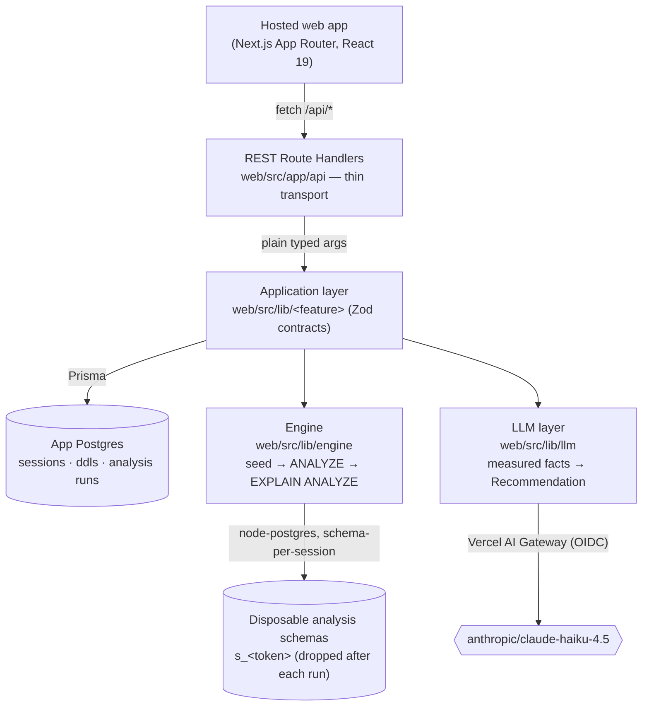

# 🕵️‍♀️ db_query_detective

> Manufacture realistic data, run real `EXPLAIN ANALYZE`, read the evidence.

**db_query_detective** takes a developer's schema (DDL) and a query, manufactures
realistic test data across several data-distribution **modes**, runs genuine
`EXPLAIN ANALYZE` against each on a disposable Postgres schema, and reports
structured findings — then a hosted LLM turns those measured facts into
prescriptive recommendations.

**[Live demo → db-query-detective.vercel.app](https://db-query-detective.vercel.app)**

---

## The problem

You can't trust a query plan until you've run it on data shaped like production —
but you rarely have production-shaped data on hand while you're still writing the
query. Existing tools (pgMustard, Postgres MCP Pro, pgtuner) assume an
already-running, already-populated database and help you tune it; none go from
bare DDL to a provisioned, synthetically-seeded instance. So the moment that
matters most — _"is this index or rewrite actually a good idea before I ship
it?"_ — is exactly the moment you have nothing realistic to test against.
db_query_detective fills that gap: it deterministically generates realistic rows
across several statistical distributions, loads them into a throwaway schema, and
runs real `EXPLAIN ANALYZE` (not hypothetical-index estimation) against each. The
result is plan shape and cost you can actually believe — plus an LLM that reasons
over those ground-truth numbers instead of guessing.

## How it works

The defining principle is a hard split between **facts** and **recommendations**:

- The deterministic **engine** only ever _measures_. It emits flags that are
  observed facts (`sort_spilled_to_disk`, `seq_scan`), backed by numbers it can
  re-verify — never advice.
- The **LLM** is the only thing that _decides_. It reads the engine's measured
  facts and produces **Recommendations** (indexes, rewrites, schema changes),
  framed as hypotheses the engine can immediately re-verify by running again.

Keeping judgment out of the engine is what makes the trustworthy core
deterministic and reproducible: identical `(schema, query, seed)` yields
byte-identical data and the same plan shape every time.

### Request flow



Walking a request through the modules:

1. **Define schema** — `PUT /api/ddl/{table}` with raw `CREATE TABLE` SQL.
   `web/src/lib/ddl` parses it with **libpg-query** (the official Postgres C
   parser, compiled to WASM) into a structured `ParsedTable` and stores it via
   Prisma, scoped to the caller's `session_id`.
2. **Analyze** — `POST /api/analyze` with `{ query }`. `web/src/lib/analyze`
   parses the query, derives a query-driven **SeedPlan**, then for each
   _applicable_ **mode** (a stress axis: `append_order`, `shuffled`,
   `skewed_range`, `high_skew`, `fan_out`) the **engine** seeds a disposable
   `s_<token>` schema, runs `ANALYZE`, and captures
   `EXPLAIN (ANALYZE, BUFFERS, SETTINGS, FORMAT JSON)`. It distills each into a
   `ModeResult` (metrics + measured-fact flags), picks the **worst mode** by
   planner total cost, persists an `AnalysisRun`, and returns the
   `AnalyzeResult`. The disposable schema is dropped in a `finally`.
3. **Recommend** — `POST /api/recommend` with `{ runId }`. `web/src/lib/llm`
   re-loads the persisted run, builds a prompt from its **measured facts** (the
   query, the schema snapshot, every mode's metrics and flags, and the worst
   mode's verbatim plan), and **streams** the LLM's Recommendation back to the
   Detective panel. The provider lives behind one vendor-aware module; the route
   stays a thin adapter.

The same Zod schemas that validate HTTP input will define the MCP tool inputs
when the MCP front door lands (see [Next steps](#next-steps)).

## Tech stack

| Area         | Choice                                                         |
| ------------ | -------------------------------------------------------------- |
| Frontend     | Next.js 16 (App Router), React 19, Tailwind CSS v4             |
| App metadata | Prisma 7 → Postgres (sessions · ddls · runs)                   |
| Engine       | node-postgres (`pg`) raw SQL on disposable `s_<token>` schemas |
| SQL parsing  | `libpg-query` (Postgres C parser as WASM) for DDL **and** DML  |
| LLM          | Vercel AI SDK → AI Gateway (`anthropic/claude-haiku-4.5`)      |
| Hosting      | Vercel + Neon (PG17); gateway auth via Vercel OIDC in prod     |

The deeper "what / where / why" lives in [`SPEC.md`](./SPEC.md),
[`ARCHITECTURE.md`](./ARCHITECTURE.md), and [`KNOWLEDGE.md`](./KNOWLEDGE.md)
(the domain glossary); design decisions are recorded under
[`docs/rfc/`](./docs/rfc).

## Local development

The stack runs in Docker (Next.js app + Postgres). Copy the env example and bring
the tiers up:

```bash
cp .env.docker.example .env.docker          # set ports + a per-worktree DB name
docker compose -f docker-compose.infra.yml --env-file .env.docker up -d   # Postgres
docker compose -f docker-compose.app.yml   --env-file .env.docker up -d   # web app
```

The app is served at `http://127.0.0.1:<WEB_PORT>`. To exercise the LLM
recommendation locally, add a Vercel AI Gateway key as
`VERCEL_AI_GATEWAY_API_KEY` in `.env.docker` (optional — in prod/preview the
gateway authenticates via OIDC, no key needed). Quality gate from `web/`:
`npx prettier --write . && npm run typecheck && npm run lint && npm test`.

## Next steps

- **MCP server with local LLM recommendations.** The daily-driver front door: a
  host model orchestrates the engine as MCP tools, running recommendations
  through a local / bring-your-own LLM instead of the hosted one — no data leaves
  your machine.
- **`COPY`-based loader for bigger datasets.** The current batched-`INSERT`
  loader caps at a modest scale; switching to `COPY` unlocks realistic 100k–1M+
  row runs with production-scale plan costs.
- **Iteration mode (MCP).** Keep the seeded data between calls and iterate quickly
  on new indexes/tables — `CREATE INDEX` + `ANALYZE` + re-run — instead of
  re-seeding from scratch every time.
- **More Postgres versions.** Plan shape varies by major version; support targets
  beyond the current PG17 baseline.
- **More database engines.** MySQL, MongoDB, and other stores beyond Postgres.
- **ORM-aware analysis.** Detect which ORM you use (Prisma, Drizzle, TypeORM, …)
  and tailor the seeding, analysis, and recommendations to its query patterns and
  migration style.
